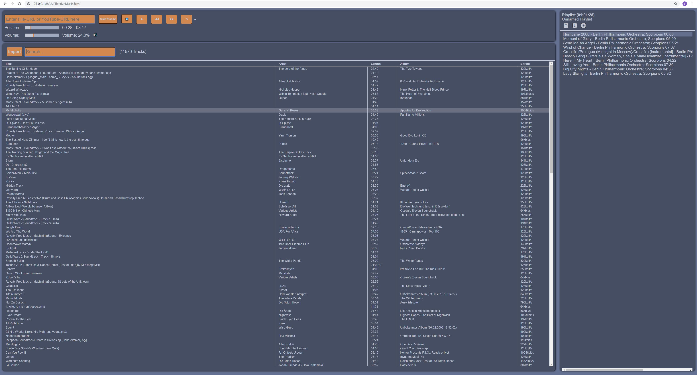

A GWT Web-Frontend for https://github.com/steffenjacobs/EffectiveMusic

# Features

-> A browser-based Media Player to remote control your Stereo System

-> Full Audio Library Control  
* Searchable Library (weighted search that takes bitrate, # played and import date into account)  
* Add Media Tracks to Library  
* Import Music YouTube into Library  
* Import new Tracks from disk or network drive into Library  

-> A fully-fledged Audio Player  
* Play Tracks from your Library  
* Play Tracks with simple File URL  
* Play the Audio of Videos from YouTube  

-> Playlist Control  
* Add and Remove Tracks to and from Playlists  
* Load and Store Playlists in common M3U format  

